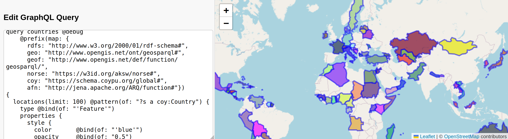

The following demonstrators showcase the use of GraphQL to query and present data from a SPARQL enpdoint.
Inspect the source code to see the underlying queries.

* A simple [WikiData Movies Browser.](https://smartdataanalytics.github.io/RdfProcessingToolkit/demos/movies/). This is a HTML one-pager that queries the GraphQL endpoint of a demo RPT instance loaded with movies from Wikidata.

* A simple [GraphQL-to-GeoJSON Demo.](https://smartdataanalytics.github.io/RdfProcessingToolkit/demos/leaflet-graphql/). This is a HTML one-pager that uses GraphQL to transform GeoSPARQL data to a customizable GeoJSON structure. It also demonstrates:
    * Ad-hoc simplification of GeoSPARQL polygons using our `geof:simplifyDp` extension function.
    * Use of caching cardinalities of properties across a dataset using `SERVICE <cache:>`, which is part of Apache Jena's [Service Enhancer extension](https://jena.apache.org/documentation/query/service_enhancer.html).

